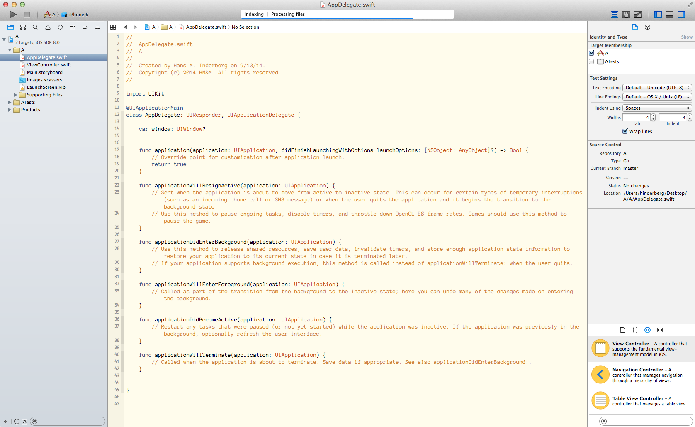

# [fit]PG5600
# [fit]iOS programmering
## Forelesning 3

---

# [fit] Hva skjedde på tirsdag?

---

# iPhone 6


---

# Apple Watch


---

# Xcode 6 GM seed



---

# iOS 8 GM seed


---

# Sist gang

* Funksjoner
* Closures
* Enumeration
* Klasser og structs
* Properties
* Metoder
* Access control

---

# Agenda - Swift del 3

* Subscripts, Kontrutører og Arv
* deinit og ARC
* Optionals og Optional chaining
* Type casting og Nested types
* Protocols
* Extentions
* Generics

---

# [fit]Subscripts

---

* Snarveier for å hente og sette elementer i en collection, liste eller sekvens
* Sette og gette på samme måte
* Kan defineres i klasser, structurs og enums

```swift

// Dictionary structures implementerer subscripts

var studenterIfag = ["ios": 10000, "android": 90, "wp": 10]

// Aksesser og sett elementer ved hjelp av key
println(studenterIfag["ios"]) // 10000
studenterIfag["ios"] = 500000

```

___

* Som kalkulerte properties, kan de vœre read-write eller read only

```swift

class EnKlassemedSubscript {

    subscript (<parameters>) -> <return type> {
        // man må ha en getter
        get {
            <statements>
        }
        // setter om man ønsker
        set(<setter name>) {
            <statements>
        }
    }
}

```

---

# [fit]Subscript overloading

---

* Definere så mange subscript man ønsker
* Type inference finner ut hvilke som skal bli brukt

```swift

class EnKlassemedSubscripts {

    ...

    subscript (pattern: String) -> Bool {

    }

    subscript (willBeDone: Bool) -> String {

    }

    ...
}

```

---

# [fit]Kontrutører

---

* Krever at man bruker navngitte parametre
* Som metoder så de omgås ved hjelp av `_`, men det anbefales ikke
* Kontanter kan settes i kontruktøren

```swift

class LivingThing {
    let birth: NSDate

    init(birth: NSDate) {
        self.birth = birth
    }
}

var aThing = LivingThing(birth: NSDate())

```

---

* Optionals og verdier med default verdi må ikke settes i kontruktøren

```swift

class LivingThing {
    let birth: NSDate
    var death: NSDate?
    var isAlive: Bool = true

    init(birth: NSDate) {
        self.birth = birth
    }
}
var livingThing = LivingThing(birth: NSDate())
```

---

* Man kan ha flere kontruktører og de kan kalle hverandre
* Det finnes to forskjellige kontruktørtyper:

---

__Designated__

* Primœr konstruktør som må initialisere alle ikke-optional, ikke-initialiserte properties
* Må kalle sin superclass konstruktør (ved arv)
* Det er ofte få eller bare en __Designated__ konstruktør
* Alle klasser må minst ha en, med mindre man har defaultverdier på alle properties

---

```swift


class LivingThing {
    let birth: NSDate
    var death: NSDate?
    var isAlive: Bool = true

    init(birth: NSDate) {
        self.birth = birth
    }
}

var livingThing = LivingThing(birth: NSDate())
```

---

__Convenience__

* Setter typisk opp en gitt state for klassen
* Krever ofte fœrre parametre
* Bruk de som en snarvei for å sette opp en ofte brukt state
* __Convenience__ må først kalle __Designated__

---

```swift
class LivingThing {
    let birth: NSDate
    var death: NSDate?
    var isAlive: Bool = true

    init(birth: NSDate) {
        self.birth = birth
    }

    convenience init() {
      self.init(birth: NSDate())
      self.isAlive = false // må vœre etter self.init
    }
}

var livingThing = LivingThing(birth: NSDate())

// convenience
var livingThing2 = LivingThing()
```

---

# [fit]Arv

---

En klasse kan arve

* metoder
* properties

og ....... alt annet fra en annen klasse

---

* En klasse som arver fra en annen betegnes __subclass__
* Klassen som __subclass__ arver fra betegnes __superclass__
* En klasse som ikke arver av noen betegnes __base class__
* En __subclass__ kan kalle metoder, properties og subscripts på __superclass__
* __subclass__ kan overstyre __superclass__ sine metoder, properties og subscripts

---

```swift
// base class og superclass

class LivingThing {

    let birth: NSDate
    var death: NSDate?

    // Kan ikke overskrives
    final var isAlive: Bool {
        return self.death == nil
    }

    init(birth: NSDate) {
        self.birth = birth
    }

    var description: String {
        return "Jeg er en levende ting som ble født \(self.birth)"
    }
}
```

---

```swift
// subclass og superclass

class Person : LivingThing {
    let firstName: String
    let lastName: String

    var fullName: String {
        return "\(self.firstName) \(self.lastName)"
    }

    // required - gjør at subclass må implementere kontruktøren
    required init(firstName: String, lastName:String, birth: NSDate) {
        self.firstName = firstName
        self.lastName = lastName
        // super kan brukes til å kalle metoder, properties og subscripts
        super.init(birth:birth)
    }

    func sayHello() -> String {
        return "Hello"
    }
}
```

---

```swift
// subclass

class Student : Person {

    // Vil gi kompile error pga required
    init {

    }

    override var description: String {
        return "Student på Westerdals med navn \(self.fullName)"
    }

    override func sayHello() -> String {
        return "Halla lizm"
    }

    // Compile error
    override var isAlive: Bool {
        return true
    }
}

var gunnar = Student(firstName: "Lars", lastName: "Gunnar", birth: NSDate())
gunnar.firstName // Lars
gunnar.description // Student på Westerdals med navn Lars Gunnar

gunnar.birth // 2014-09-07 14:17:59 +0000
```

---

# Deinit

Deinitializer kalles rett før klassen blir fjernet fra minne


```swift
class Student : Person {

    override var description: String {
        return "Student på Westerdals med navn \(self.fullName)"
    }

    override func sayHello() -> String {
        return "Halla lizm"
    }

    deinit {
      School.removeStudent(self.id)
    }
}
```

---

# [fit] ARC

---

- Vanligvis håndterer ARC automatisk minne for deg, men av og til må man gjøre litt selv
- Implisitt sterk referanse
- Alt som har en referanse blir holdt i minne

```swift


var reference1: Student?
var reference2: Student?

reference1 = Student(firstName: "Lars", lastName: "Gunnar", birth: NSDate()) // sterk referanse
reference2 = reference1 // To sterke referanser til Lars

reference1 = nil // en sterk referanse igjen
reference2 = nil // ingen refferanse igjen, instansen blir fjernet fra minne og deinit blir kalt
```

---

- Hvordan løser vi sirkulœre avhengigheter?
- Bruk __weak__ for å si at man ikke ønsker å øke referansetelleren
- Man kan ikke bruke __weak__ på kontanter, da en weak vil kunne endre seg runtime

---

```swift

class Student : Person {
    ...

    weak var school: School?

    ...
}

class School {

    ....

    var students = [Student]()

    ....
}

```

---

- Hvis refferansen kan bli nil en gang i løpet av applikasjonens kjøretid, bruk __weak__
- Bruk __unowned__ i stedet for weak der du vet at verdien alltid vil vœre satt

---

```swift
class Student : Person {
    ...

    unowned var school: School?

    ...
}

class School {

    ....

    var students = [Student]()

    ....
}
```

---

# [fit]Se boken for mer informasjon om
# [fit]minnehåndtering
<br/>
### _Under kapitellet -> Automatic Reference Counting_

---

# [fit]Optional Chaining

---

```swift


if let street = westerdals.students.first?.address?.street {
    println("Studenten bor i \(street).")
} else {
    println("Kunne ikke hente gatenavn")
}
```

- Du kan akserssere properties
- Kalle metoder
- Kalle subscript

---

# [fit]Type Casting

---

# [fit]_is_
- brukes til å sjekke typen til en instans

# [fit]_as_
- brukes til å behandle en instans som om det var en annen type i dens typetre

---

```swift
class LivingThing {}
class Person: LivingThing {}
class Animal: LivingThing {}

let living = [
    Person(birth: NSDate()),
    Animal(birth: NSDate()),
    Person(birth: NSDate()),
    Animal(birth: NSDate()),
    Animal(birth: NSDate())
]

living[0] is Person // true
living[1] is Animal // true
living[2] is Animal // false

```

---

# as?

```swift


for item in living {
    if let person = item as? Person {
        println("Is alive: \(person.isAlive)")
    } else if let animal = item as? Animal {
        println("\(animal.roar())")
    }
}
```

---

# [fit]Any og AnyObject

---

- AnyObject kan representere en instans hvilke som helst klassetype
- Any kan representere en instans av hvilke som helst type, foruten funksjontyper
- Bør bare brukes når man faktisk trenger det, vœr eksplisitt

---

```swift

// Cocoa apis og array vil alltid innholde AnyObject,
// da Objective-C ikke har eksplisitte typede arrays

let someObjects: [AnyObject] = [
    Person(birth: NSDate()),
    Person(birth: NSDate()),
    Person(birth: NSDate())
]

for person in someObjects as [Person] {
    println("Is alive: \(person.isAlive)")
}

```

---

```swift
var things = [Any]()

things.append(0)
things.append(42)
things.append(3.14159)
things.append("hello")
things.append((3.0, 5.0))

for thing in things {
    switch thing {
    case 0 as Int:
        println("Det var en int som var 0 der ja")
    case let someInt as Int:
        println("Fant en int som er \(someInt)")
    case let someDouble as Double where someDouble > 0:
        println("en positiv Double \(someDouble)")
    case is Double:
        println("En eller annen Double var også der gitt")
    case let someString as String:
        println("fant en string som inneholder \"\(someString)\"")
    case let (x, y) as (Double, Double):
        println("en (x, y) verdi der x \(x), y \(y)")
    default:
        println("noe annet greier")
    }
}
```

---

# [fit]Nested types

---

- Man kan ha klasser, structurs og enums nestet i hverandre


```swift


struct Student {

    enum Mood: String {
        case Sad = ":(", Happy = ":)"
    }

}

Student.Mood.Sad.toRaw()
```
---

# [fit] Extentions

---

* Utvide funksjonalitet for en bestemt type
* Vanlig og static kalkulerte properties
* Definere nye instansmetoder og klassemetoder
* Nye init metoder
* Nye subscripts
* Definere ny nestet type
* Gir mulighet å implementere en protocol for en eksiterende type

---

```swift


extension String {
  var uppercase: String { return self.uppercaseString }
}

var name = "Hans Magnus"
name.uppercase // "HANS MAGNUS"

```

---

# Protocols

* _Samme som interface i Java og andre språk_
* _Definerer opp et sett med metoder, properties, klasse metoder, operatorer og subscripts som passer en bestemt funksjonalitet_
* _Inneholder ingen implementasjonskode_

---

```swift


protocol LivingThing {
  var mustBeSettable: Int { get set }
  var doesNotNeedToBeSettable: Int { get }


  class func someTypeMethod()
  func random() -> Double
  mutating func toggle() // gjør det mulig å endre properties
}
```

- En protocol kan brukes alle steder hvilke som helst type ville bli brukt
- En klasse, struct eller enum kan implementere flere protocols
- Protocols kan arve av hverandre
- Mer om protocols når vi går over til iOS

---

# [fit] Generics

---

* Mye av Swift sitt standard bibliotek er bygd med generics kode
* Eksempelvis er Array og Dicionary av typene generic collections
* Kan definere at typen i det minste skal implementere en protocol "Type Constraints"

---

# Generic functions

```swift

func printSequence<T: SequenceType>(sequence: T) {
    for part in sequence {
        println(part)
    }
}

printSequence("ABCDEF")
printSequence(["Aa", "Bb"])
printSequence(["A": "B", "B": "A"])
```

---

# Generic Types

- Enums, structs og klasser kan også vœre generiske
- Array og Dictionary er eksempler på generiske structs

---

```swift
class GenericClass<T> {
    var object: T

    init(object: T) {
        self.object = object
    }

    func getObject() -> T {
        return self.object;
    }

    func prinObject() {
        println("Type of T is \(self.object)");
    }
}

var a = GenericClass<Int>(object: 1)
a.prinObject()

```

---

# Associated Types

- I en protokoll kan man lage et alias (associated type) der det er opp til implementasjonen å definere den faktiske typen.
- Dette er for å kunne referere til typen i metoder og subscripts uten at man bestemmer typen i protokollen

---

```swift
protocol Container {
    typealias ItemType
    mutating func append(item: ItemType)
    var count: Int { get }
    subscript(i: Int) -> ItemType { get }
}

class Example: Container {
    typealias ItemType = String
    var array = [ItemType]()

    func append(item: ItemType) {
        self.array.append(item)
    }

    var count: Int {
        get {
            return countElements(array)
        }
    }

    subscript(i: Int) -> ItemType {
        get {
            return array[i]
        }
    }
}
```

---

# Where

```swift


func allItemsMatch<
    C1: Container, C2: Container
    where C1.ItemType == C2.ItemType, C1.ItemType: Equatable>

    (someContainer: C1, anotherContainer: C2) -> Bool
{
  // funksjonskropp
}
```

---

# [fit]Oppgaver

##[fit] Se [Øvingsoppgavene](oppgaver3.md)
