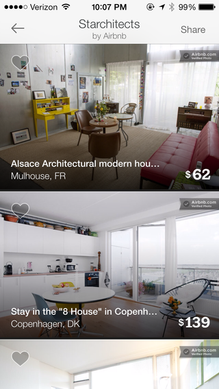
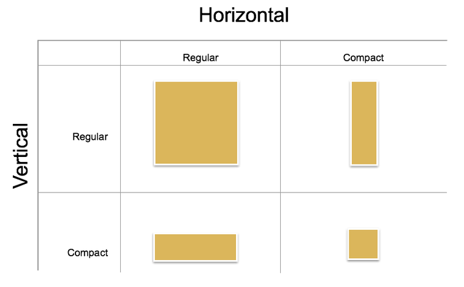
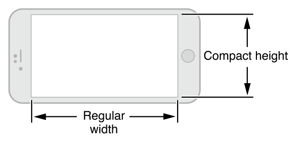
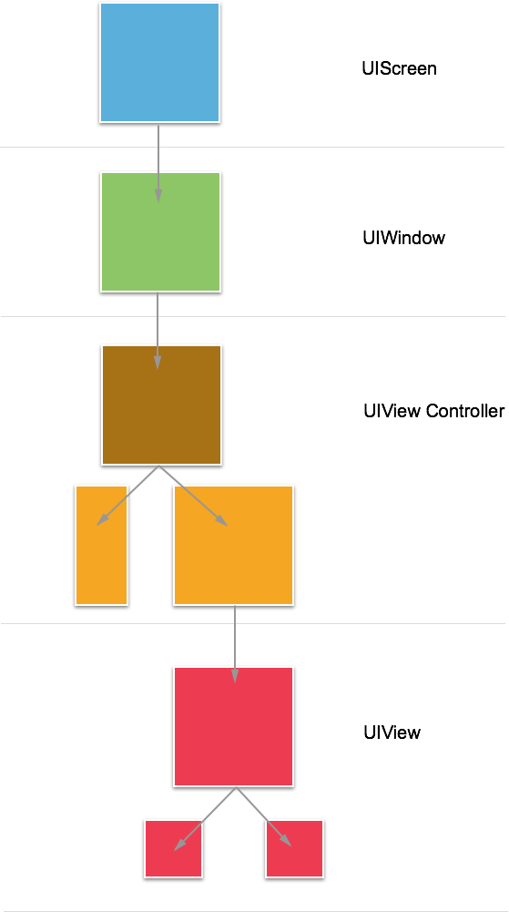

# [fit]PG5600
# [fit]iOS programmering
## Forelesning 5

---

# Sist gang

* Sette opp et nytt iOS prosjekt i XCode
* Komponentene i en iOS app
* Launch flow
* Application lifecycle
* MVC
* View og view controllers

---

# Agenda

* Delegate pattern
* UINavigationController
* UITableView og UITableViewController
* UICollectionsView og UICollectionViewController
* Auto Layout
* Unified Storyboard og Size classes

---

# [fit]Delegate pattern

---

* Design pattern for å få et objekt til å delegere deler av sine oppgaver til et annet objekt
* Det delegerne objektet holder på en refferanse til et annet objekt kalt delegatet
* Det delegerende objektet kaller en eller flere metoder på delegatet
* Delegate patterne er mye brukt i Cocoa Touch

---


---

# Hva trengs?

---
# [fit]En protocol

---

```swift


protocol DataHandlerProtocol {
    func didFinishGettingData(data: NSData)
    func didFailGettingData(error: NSError)
}
```

---

# [fit]Et delegat som implementerer protocolen

---

```swift


class A : DataHandlerProtocol {
    func didFinishGettingData(data: NSData) {
        println(data)
    }

    func didFailGettingData(error: NSError) {
        println(error)
    }
}
```

---

# [fit]Et delegerende objekt

---

```swift


class Fetcher {

    var delegate: DataHandlerProtocol?

    func fetch() {
        delegate?.didFinishGettingData(NSData())
    }

}
```

---

# [fit] Brukes blant annet av:

---

# [fit]UINavigationController

---

* En av standard komponentene
* Holder på en samling av UIViewController's
  * _En UIViewController holder på en samling av views_
* En UINavigationController kordinerer navigasjonen mellom UIViewController
* I tillegg til navigasjon har den også ansvar for en UINavigationBar og en UIToolbar

---


---

UIViewController er håndtert av UINavigationController ved å:

* Pushe og poppe UIViewController på UINavigationController view stacken
* Når et view blir pushet, så blir nåvœrende view dyttet ut av skjermen til venstre og det nye kommer inn fra høyre
* Om du bruker storyboard så blir alt dette automatisk håndtert
* Hvis du bruker XIB filer eller bare kode så må du selv pushe og poppe

---


---

# [fit]Demo

---

# Kan jeg gjore det i kode?

```swift


func application(application: UIApplication, didFinishLaunchingWithOptions launchOptions: [NSObject: AnyObject]?) -> Bool {

    self.window = UIWindow(frame: UIScreen.mainScreen().bounds)

    var root = UIViewController()
    root.view.backgroundColor = UIColor.greenColor()
    var navController = UINavigationController(rootViewController: root)

    self.window?.rootViewController = navController;

    self.window?.makeKeyAndVisible()

    return true
}

```

---

# Push og pop

```swift


var viewController = UIViewController()
navController.pushViewController(viewController, animated: true)
navController.popViewControllerAnimated(true)
```

---

# UIButton og UINavigationBar

```swift
class ViewController: UIViewController {

    override func viewDidLoad() {
        super.viewDidLoad()

        var rightButton = UIBarButtonItem(
          barButtonSystemItem: UIBarButtonSystemItem.Add,
          target: self,
          action: Selector("buttonTouched:"))

        self.navigationItem.rightBarButtonItem = rightButton;
    }

    func buttonTouched(sender: AnyObject) {
        self.navigationController?.pushViewController(ViewController(), animated: true)
    }

    override func didReceiveMemoryWarning() {
        super.didReceiveMemoryWarning()
    }
}
```

---

# UILabel/Tittel og UINavigationBar

```swift
class ViewController: UIViewController {

    override func viewDidLoad() {
        super.viewDidLoad()


        self.navigationItem.title = "Test tittel"


    }
}
```

---

# [fit]UITableView
# _&_
# [fit]UITableViewController

---

# Noen bruksområder

* Navigere hiarkist data
* Presentere en liste av elementer
* Vise detaljinformasjon og kontroller i visuelle grupperinger
* Vise valgbare alternativer

---

### Spotify


---

### Peek


---

### Airbnb



---

# Egenskaper og innhold

* Hver rad består av en UITableViewCell
* Kommer med noen pre-definerte design (kan lage egne)
* Kan respondere på at man klikker på en celle
* Har implementert editeringsmuligheter:
 * Legg til
 * Fjern
 * Omorganisering

---


---

# [fit]Demo
### plain style, grouped style, predefinerte design

---

# [fit]Demo
# [fit]navigasjon med navigation controller

---

# Men hvordan sette data før man navigerer? Fra sist!

```swift
class ViewController: UIViewController {

    @IBOutlet weak var message: UITextField!

    // Kalles før overgangen skjer også med navigation controller
    override func prepareForSegue(segue: UIStoryboardSegue, sender: AnyObject!) {

        if let vc = segue.destinationViewController as? ReceivingViewController {
            vc.message = message.text
        }

    }
}
```

---

# [fit]Collections
# Views

---

* Er et mer fritt alternativ til UITableView
* Støtter endringer av layout og setter få, om ikke ingen begrensninger for layout
* En typisk collection view layout er den innebygde UICollectionViewFlowLayout, som viser en grid
* Endringer gjøres ved hjelp av subclassing og de kan endre seg dynamisk
* Så du kan implementere grids, stacks, sirkulœre eller hva som helst du kan se for deg

---


---

# [fit]Demo

---

#[fit] Auto Layout

---

* Legger ut ditt brukergrensesnitt basert på et sett med regler
* Du definerer opp reglene ved hjelp av Auto Layout
* Målet er å lage dynamisk grensesnitt som responderer på endringer i størrelse, orientering og lokalisering (språk)
* Auto Layout er bygd inn i Interface Builder

---

# [fit]Demo
# [fit]Constraint og Interface Builder

---

# Programatisk

* Visual Format Language

```swift


let views = ["button1": UIButton(), "button2": UIButton()]
var constraints = NSLayoutConstraint.constraintsWithVisualFormat(
  "[button1]-[button2]",
  options: NSLayoutFormatOptions.AlignAllBaseline,
  metrics: nil,
  views: views
)
```

---

# [fit]Unified Storyboard
#                                &
# [fit]Size classes

---

#### Hva er det til?

# For å gjøre det enklere å støtte flere skjermstørrelser

---

#### Hvorfor?

## Apps bør tilpasse seg endring i orientering og skjermstørrelse for å gi en bedre brukeropplevelse

---

# Size classes

* Regular - Representerer mye skjermplass
* Compact - Representerer lite skjermplass

---


###### _http://developer.xamarin.com/guides/ios/platform_features/intro_to_unified_Storyboards/_

---


---


---

# iPhone 6+



---

# Traits

* Et system for å håndtere size classes
* Består av et sett med properties som kan brukes for å definere opp hvordan ditt layout skal endre seg ettersom miljøet endrer seg

```swift
class UITraitCollection : NSObject, NSCopying, NSSecureCoding, NSCoding {
    ...

    var userInterfaceIdiom: UIUserInterfaceIdiom { get }
    var displayScale: CGFloat { get }
    var horizontalSizeClass: UIUserInterfaceSizeClass { get }
    var verticalSizeClass: UIUserInterfaceSizeClass { get }
    ...
}
```

---

# Tilgjengelig på følgende objekter igjennom UITraitEnvironment

* Screens ( UIScreens ).
* Windows ( UIWindows ).
* View Controllers ( UIViewController )
* Views ( UIView )
* Presentation Controller ( UIPresentationController )

* Man arver traits nedover i arvetreet

---


###### _http://developer.xamarin.com/guides/ios/platform_features/intro_to_unified_Storyboards/_


---

```swift


func traitCollectionDidChange(previousTraitCollection: UITraitCollection)
```


---

```swift


class UITraitCollection : NSObject, NSCopying, NSSecureCoding, NSCoding {

    ...

    func containsTraitsInCollection(trait: UITraitCollection!) -> Bool

    ...
}
```

---

# [fit]Demo

---

# [fit]Oppgaver

##[fit] Se [Øvingsoppgavene](oppgaver5.md)

##[fit] https://github.com/hinderberg/ios-swift-kurs
