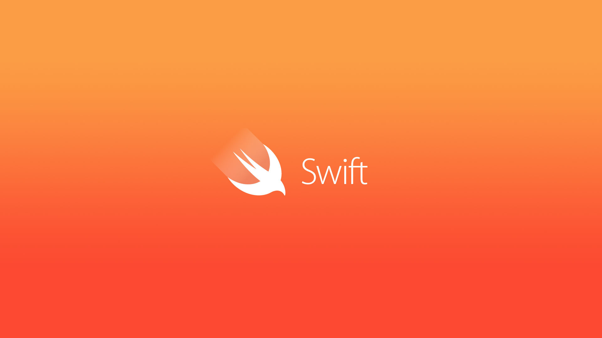
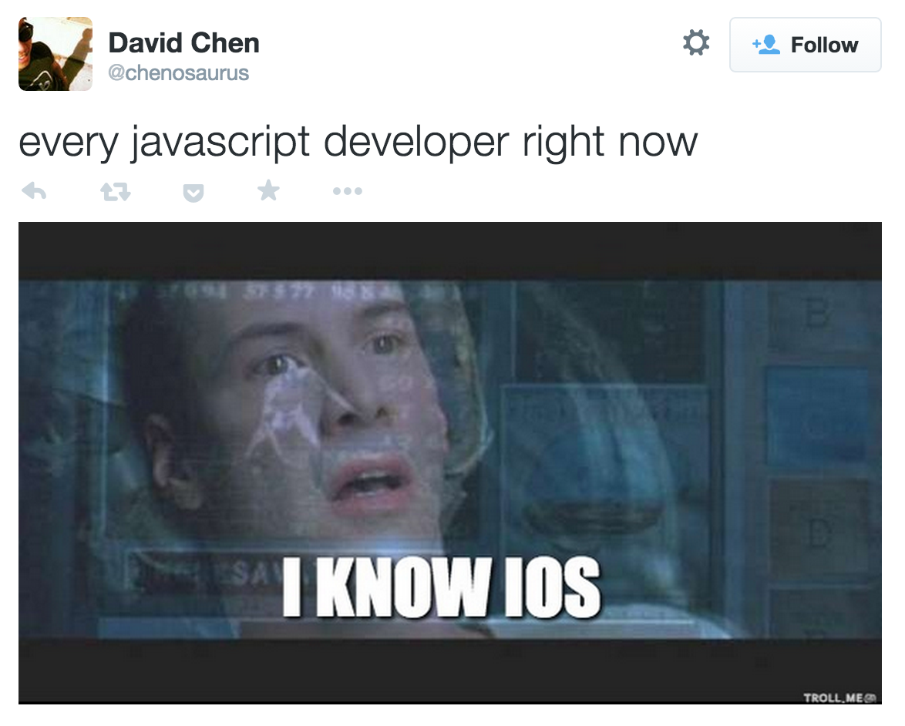

## Introduksjon til
# [fit] Swift

---

# Mads Mobæk
Fagleder frontend
@madsmobaek

# Hans Magnus Inderberg
Fagleder mobil
@hinderberg

---


^ * WWDC i starten av Juni,
* Uventet
* Nytt programmeringsspråk kalt .....

---



^ Swift.

---


^ * En som kaster Objective-C boken sin.


---



---


^ * Eller som Matt Thompson
* Alle er nybegynnere samtidig
* Ingen bedre tid enn nå til å starte med iOS og OSX utvikling

---

# Agenda

1. Hva er Swift?
2. Hvordan ser det ut?
3. Playground & REPL

---

# Hva er Swift?
* Et programmeringsspråk for iOS og OSX laget av Apple
* Swift tar over for Objective-C
* Moderne, enkelt og sikkert
* Fungerer side om side med C og Objective-C
* Paradigmer som imperativt, OOP og funksjonelt

^ * Laget av Apple
* Under utvikling i rundt fire år
* Fjernet avhengighet for å få mer frihet
* Laget en bro til C og Obj-C
* Kjente paradigmer som funksjonelt og OOP

---

# Hvordan ser det ut?

---

```swift
			   println("Hello world")
```

^* Dette er et helt program i Swift
* Printer ut Hello world på en ny linje

---

# Konstanter og Variabler

```swift


let shortName: String = "BEKK"

var numberOfemployees: Int = 320
numberOfemployees = 500
```

^ * Konstanter deklareres LET
* Variabler med VAR
* Type defineres med kolon og type
* Konstant kan bare bli satt en gang, men det må ikke skje ved kompilering
* Oppfordrer til imutabilitet over mutabilitet

---

# Type inference
```swift


let shortName = "BEKK"

var numberOfemployees = 350
numberOfemployees = 500
```


^ * Stort fokus i Swift.
* * Du skjelden trenger å spesifisere typen. Men typen vil fortsatt vœre der.

^ * De analyserer både oppover og nedover i type-treet.
* Analysere output av det du setter variabelen din til for å finne typen.

^ * Verdier vil aldri automatisk skifte type,
* Legge sammen er string og int, så må du eksplisitt konvertere en av dem.

---

# Unicode støtte


```swift


                   let 🌍 = "😩😛😵😘"
```


^Jada, du kan bruke emicons
* Men fokuset her er å la utviklere utvikle i det språket de snakker

---

# String Interpolation

```swift


let n1 = 10, n2 = 8
let result = "\(n1) ganger \(n2) er \(n1 * n2)"
//10 ganger 8 er 80
```

^Strenger kan kombineres ved hjelp av streng interpolation.
* Der man også kan skrive matematiske utrykk
* Kalle funksjoner
^ * Bro mellom Objective-C NSString og Swift String, noe som gjør at man kan benytte disse om hverandre.

---

# Collection types

Det finnes to typer collections i Swift

<br />

* Arrays
* Dictionaries


^ * De vanlige typene finnes også i Swift.
* Map i java

---

# Array

```swift
// Deklaring
let jobs = [String]()

// merk ingen spesifisering av type
var jobs = ["Systemutvikler", "Prosjektleder", "Frontendutvikler"]

// Uthenting
jobs[0]
```

^ Et array deklareres på veldig standard måte, med to klammer. Uthenting er som vanlig.
Forskjellig fra objective-c er at type inference gjør at disse er typed arrays

---

```swift
// Manipulering

jobs.append("Rådgiver")
jobs += ["Rådgiver", "Backendutvikler"]
jobs[0] = "Backendutvikler"
jobs[2..<5] = ["Rådgiver", "Backendutvikler", "Prosjektleder"]
```

---

# Dictionary

```swift
// Deklaring
let emptyDictionary = [String: Float]()
var jobs = ["Rådgiver": 35, "Systemutvikler": 21, "Prosjektleder": 32]

// Uthenting
jobs["Systemutvikler"]

// Modifisering
jobs["Rådgiver"] = 45
jobs["Prosjektleder"] = 81
```

^ I dicionary så holdes ting på normalt nivå og mange av dere kjenner nok igjen dette fra andre språk.

---

# Løkker

* while
* do-while
* for
* for-in

^ Ikke noe nytt her altså, og de gjøres på vanlig måte

---

# Ranges

```swift


for nr in 1...10 {
	println("\(nr) ganger 2 er \(nr*2)")
}

for nr in 1..<10 {
	println("\(nr) ganger 2 er \(nr*2)")
}

```

^_1…10 – Går fra 1 til 10. Og er kjent som en closed range._
 _1..<10 – Går fra 1 til 9. Og er kjent som en half-closed range_

---

# Control flow
<br />

* if
* switch

---

# if

* Ikke noe nytt, men parenteser er valgfritt

```swift
if batteryLevel <= 10 {
    indicator.backgroundColor = .redColor()
} else if batteryLevel >= 80 {
    indicator.backgroundColor = .greenColor()
} else {
    indicator.backgroundColor = .blackColor()
}
```

---

# switch

```swift
switch batteryLevel {
    case 0,1,2,3,4,5,6,7,8,9,10:
        println("Lavt batteri")
    case 80...100:
        println("Masse batteri")
    default:
        println("Passe med batteri")
}
```
^
* break
* hvilket som helst objekt
* må matche alle caser eller bruke default
* Switche på instanster
* regulœre utrykk,
* where clause etc

---

# Enums

```swift
enum Level {
    case Consultant
    case Senior
    case Manager
}

// eller
enum Level {
    case Consultant, Senior, Manager
}

```

---

# Enums Raw og Associated verdier

```swift
// Enumeration Raw Values
enum ASCIIControlCharacter: Character {
    case Tab = "\t"
    case LineFeed = "\n"
    case CarriageReturn = "\r"
}

// Enumeration Associated Values
enum Barcode {
    case UPCA(Int, Int, Int, Int)
    case QRCode(String)
}
var productBarcode = Barcode.UPCA(8, 85909, 51226, 3)
productBarcode = .QRCode("ABCDEFGHIJKLMNOP")
```

^Kan ha konstruktører, funksjoner, variabler
Barcode med tuple med 4 verdier

---

# Optionals


^ mange måter i objective-c, NSNull, null, nil, NULL, -1...etc
* Rammeverk og hva bruker de? Løst med optionals

---

```swift


var possibleWelcomeMessage: String? = "Halloo"

if possibleWelcomeMessage == nil {
	println("Det er ingen streng her!")
} else {
	// unwrapping med !
	let welcomeMessage = possibleWelcomeMessage!
	println(welcomeMessage)
}
```

^Greit å vite at typer som ikke er optional kan ikke vœre nil.
Da får man kompile error

---

```swift


if let welcomeMessage = possibleWelcomeMessage {
		println(welcomeMessage)
}
```

^Automatisk unwrapping og sette verdien i en if

---

# Optional chaining

```swift


if let street = bekk.people.first?.address?.street {
    println("Personen bor i \(street).")
} else {
    println("Kunne ikke hente gatenavn")
}
```

---

# Funksjoner

---

# Funksjoner


```swift
func printName() {
  println("Swift")
}

printName()
```

^* Deklareres med `func`

---

# Funksjoner med parametere

```swift
// default konstanter
// hvis ikke spesifisert at de skal vœre variabler
// med da blir de kopiert. Med mindre man bruker `inout`

func printName(name: String) {
  println(name)
}

printName("Swift")
```

---

# Funksjoner med defaultverdier

```swift

func printName(name: String = "Swift") {
  println("Hallo \(name)!")
}
printName()
printName(name: "Swift")
```

^name: blir en del av signaturen

---

# Funksjoner med returverdi

```swift


func buildName(firstName: String, lastName: String) -> String {
	return "\(firstName) \(lastName)"
}

let fullName = buildName("Tim", "Cook")
```
---

# Funksjoner med navngitte parametre

```swift


func buildName(
    yourFirstName firstName: String,
    #lastName: String) -> String {
        return "\(firstName) \(lastName)"
}

buildName(yourFirstName: "Tim", lastName: "Cook")
```
---

# Funksjoner med multiple return

Godt egnet i funksjoner som skal returnere flere verdier - ikke så godt for komplekse datastrukturer.

```swift


func refreshWebPage() -> (Int, String) {
  return (200, "success")
}

let (statusCode, message) = refreshWebPage()
println("Fikk status \(statusCode): \(message)")
```

---

```swift

// Navngi felter i tuple returverdi

func refreshWebPage() -> (code: Int, message: String) {
  return (200, "success")
}

let status = refreshWebPage()
println("Fikk status \(status.code): \(status.message)")
```

---

# Funksjoner som parametre

```swift
func addTwoInts(a: Int, b: Int) -> Int {
    return a + b
}

func printMathResult(mathFunction: (Int, Int) -> Int,
	a: Int, b: Int) {
    println("Resultat: \(mathFunction(a, b))")
}

printMathResult(addTwoInts, 3, 5)
```

---

# Nøstede funksjoner

```swift
func jump(method: String) -> (Int) -> String {
    func vertizal(lenght: Int) -> String { return "Jeg hoppet \(lenght)m fremover" }
    func horizontal(height: Int) -> String { return "Jeg hoppet \(height)m høyt" }
    func notJumping(lenght: Int) -> String { return "Jeg droppet å hoppe \(lenght)m" }

    if method  == "vertical" {
        return vertizal
    } else if method == "horizontal" {
        return horizontal
    } else {
        return notJumping
    }
}

println(jump("vertical")(1))
println(jump("horizontal")(2))
println(jump("")(2))
```

---

# Closures

---

# Closures

```swift


{ (parameters) -> returnType in
    statements
}

```

^ Samme som funksjoner, bare uten navn!

---

```swift
// Closure inn til den innbygde sorteringsfunksjonen

reversed = sorted(names, { (s1: String, s2: String) -> Bool in
    return s1 > s2
})
```

---

```swift
// Med type inference


reversed = sorted(names, { s1, s2 in return s1 > s2 } )
```
^ Closures på speed
Dropp typer

---

```swift
/* Implisitt retur når man
har en single-expression closure */


reversed = sorted(names, { s1, s2 in s1 > s2 } )
```

---

```swift
// Snarvei for argumentnavn


reversed = sorted(names, { $0 > $1 })
```

---

```swift
/*
Swift’s String type definerer sin spesifikke
implementasjon av > operatoren som en funksjon som
har to paramerte av typen string og returnerer Bool
*/
reversed = sorted(names, >)
```

---

# Closures som parametre

```swift
func repeat(count: Int, task: () -> ()) {
    for i in 0..<count {
        task()
    }
}

repeat(2, {
    println("BEKK!")
})
```

---

# Trailing closure

```swift


repeat(2) {
    println("BEKK!")
}
```


---

# Klasser og Structs

---

# Klasser og Structs
<br />

* Klasser = Pass by reference
* Structs = Pass by value

^ * Reference types øker bare antall pekere til det samme objektet.
* Value types blir kopiert

---

```swift
struct Position {
    let latitude: Float
    let longitude: Float
}

class Address {
    let position: Position?
    var street: String?
}
```

^Slipper endelig .h filer, trenger ikke arve av NSObject
Et eksempel på stored properties

---

# Klasser og structures har mye til felles
* _Definere properties_
* _Definere metoder_
* _Definere subscripts (snarveier for å hente verdier)_
* _Definere kontruktører_
* _Kan bli utvided med extentions_
* _Kan implementere protocols_

---

# Klasser kan i tillegg

* _Arv_
* _Type casting - man kan sjekke og tolke typen runtime_
* _`deinitializers` for opprydding når instansen blir kastet_
* _Referansetelling - mer enn en referanse til en instans_

---

# Eksempel

```swift


let positionX = Position(latitude: 59.903933, longitude: 10.739286)
var positionY = positionX
positionY.latitude = 60.233333
// her blir ikke positionX endret

var address = Address(street: "Akershusstranda 21")
var address2 = address
address2.street = "Sluppenveien 17A"
// Både address og address2 sin addresse blir endret
```

^Legg merke til at man slipper alloc og eller new
Man har også konstruktører og de heter init

---

# Når bruke struct

* _Når du skal enkapsulere enkle dataverdier_
* _Når verdiene bør bli kopiert og ikke referert til_
* _Når alle properties i structuren er value types_
* _Når man ikke trenger arv fra andre typer_

Eksempel: _String, Array og Dictionary er structs_

---

# Access Control

_Access Control på blant annet:
klasser, structs, metoder og properties._

```swift


public class Address {}
internal class Address {} // default
private class Address {}
```

^ Ligner veldig på for eksempel Java

---

# Kalkulerte properties

```swift
class Employee {
    var address: Address?
    var salary: Double = 100000
    var bonusFactor = 0.20
    
    var bonus: Double {
        get {
            return self.salary * bonusFactor;
        }
        set(newBonus) { // må ikke ta inn noe, da kan man bruke newValue i stedet
            self.bonusFactor = newBonus
        }
    }
}
```

---

# Observable properties

```swift
class Employee {
    var address: Address?
    var salary: Double = 100000
    var invoicing: Double = 100.00 {
        willSet(newInvoicing) {
            println("I ferd med å sette ny faktueringsgrad \(newInvoicing)")
        }
        didSet {
            if invoicing > oldValue  {
                println("Økte faktueringsgrad med \(invoicing - oldValue)")
            }
        }
    }
}
```

---

# Metoder?
<br /><br /><br />


_Som funksjoner - bare at nå er de inne i en klasse_

---

# Klassemetoder

```swift
class Address {
    class func someMethod() {

    }
}

struct Position {
    static func someMethod() {

    }
}
```

---

# Arv

```swift
class SomeSubclass: SomeSuperclass {
    var message = "I'm a subclass!"
    
    override func speak() {
        println("Subclass says \(message)")
    }
    
    override var description: String {
        return super.description + " message: " + message
    }
}
```

^Bruk final hvis du ikke ønsker at man skal kunne bruke override ved arv_

---

# Protocols

```swift
protocol Firm {
	var mustBeSettable: Int { get set }
	var doesNotNeedToBeSettable: Int { get }


	class func someTypeMethod()
	func random() -> Double
}
```

^* Ganske likt Objective-C, brukes fortsatt til delegate pattern
* Samme som interface i Java og andre språk
* Definerer opp et sett med metoder, properties, klasse metoder, operatorer og subscripts som passer en bestemt funksjonalitet
* Inneholder ingen implementasjonskode

---

# Extensions

* _Utvider funksjonalitet for en bestemt type_

```swift
extension String {
	var uppercase: String { return self.uppercaseString }
}

var name = "Hans Magnus"
name.uppercase // "HANS MAGNUS"

```

---

# Generics

* Mye av Swift sitt standard bibliotek er bygd på generics
* For eksempel er Array og Dicionary typene generic collections

---

```swift
func printSequence<T: SequenceType>(sequence: T) {
    for part in sequence {
        println(part)
    }
}

printSequence("ABCDEF")
printSequence(["Aa", "Bb"])
printSequence(["A": "B", "B": "A"])
```


---

# Playground & REPL

---

# Playground

* Ligner på Scala worksheets
* Kjører kode forløpende i XCode
* Test ut nye algoritme, tester, utforsk apier, rett en bestemt bug

---

# REPL

* Read–eval–print loop, som i Python, Ruby m.fl.
* Tilgjengelig både når man debugger og i terminalen
* Startes med ```xcrun swift``` i terminalen

---

```swift
#!/usr/bin/env xcrun swift

import Cocoa
import Appkit

var arguments = Process.arguments;
arguments.removeAtIndex(0)

if arguments.count != 1 {
    println("Usage: ./wallpaper.swift -- [wallpaper path]")
    exit(1)
}

let path = arguments[0]
println("Finding wallpaper at path: \(path)")


// continues on next slide
```

---

```swift
let workspace = NSWorkspace.sharedWorkspace()
let screen = NSScreen.mainScreen()

let potentialImgUrl : NSURL? = NSURL.fileURLWithPath(path)
var error : NSError?

if let imageUrl = potentialImgUrl {
    let result : Bool = workspace.setDesktopImageURL(imageUrl, forScreen: screen!, 
    options: nil, error: &error)

    if result {
        println("Wallpaper set!")
    } else {
        println("Failed setting wallpaper")
    }
} else {
    println("There is something wrong with the path: \(path)")
}
```

---

# Swift v1.1 med XCode 6.1
## Språket er under aktiv utvikling

^Ikke stabilt før om omtrent 2 år
* Kan brukes i dag
* Xcode embedder en liten runtime i appen
* Så runtimen vil ikke ligge på iOS før om noen år

---

# [fit] Gira?
# [fit] _**Lykke til!**_
##### _https://developer.apple.com/swift/_

---

# One more thing
### _github.com/hinderberg/ios-swift-kurs_
